# 📰 Blog to LinkedIn

A new blog post goes in. A LinkedIn caption and a custom illustration come out. The workflow only picks an article it has not posted before, then stops on a preview until you say otherwise.

The sheet remembers every article. Monday-you does not.

`testMode` starts as `true`, so the first run will not publish.

## 🎬 Demo

https://github.com/user-attachments/assets/e77c42bf-bb3d-442a-bb7e-8e189ff8449c

## 🗺️ How it runs

```mermaid
flowchart LR
  rss[RSS Read] --> prepare[Prepare Blog Data]
  prepare --> sheet[Google Sheets dedupe]
  sheet --> newItem{New article?}
  newItem -->|No| stopNode[Stop]
  newItem -->|Yes| groq[Write post with Groq]
  groq --> gemini[Gemini if Groq fails]
  gemini --> image[Cloudflare illustration]
  image --> preview[Browser preview]
  preview --> live{testMode is false?}
  live -->|No| stopNode
  live -->|Yes| post[Post to LinkedIn]
  post --> log[Append row to Google Sheet]

  classDef blue fill:#DBEAFE,stroke:#2563EB,color:#1E3A8A
  classDef amber fill:#FEF3C7,stroke:#D97706,color:#78350F
  classDef purple fill:#EDE9FE,stroke:#7C3AED,color:#4C1D95
  classDef pink fill:#FCE7F3,stroke:#DB2777,color:#831843
  classDef teal fill:#CFFAFE,stroke:#0891B2,color:#164E63
  classDef green fill:#D1FAE5,stroke:#059669,color:#064E3B
  classDef gray fill:#F1F5F9,stroke:#64748B,color:#334155

  class rss,prepare blue
  class sheet,newItem amber
  class groq,gemini purple
  class image pink
  class preview,live teal
  class post,log green
  class stopNode gray
```

1. **Read** the blog feed.
2. **Skip** anything already in the Google Sheet.
3. **Write** the caption with Groq. Gemini tries if Groq fails. If both fail, a short fallback uses the article title and summary.
4. **Draw** a clean illustration with Cloudflare.
5. **Preview** it in the browser.
6. **Publish** to LinkedIn and log the article. This happens only after you set `testMode` to `false` in **Prepare Blog Data**.

## ✍️ The writing prompts

The caption prompts in **Generate Post - Groq**, **Generate Post - Gemini**, and **Generate Post - Ollama** are already engineered for a short, practical LinkedIn post. Open any of those nodes and edit the prompt if you want a different voice, length, or industry. The image brief is in **Generate Image Concept** and **Generate Image Concept - Gemini Fallback**. Same idea: it is ready, and you can still tune it.

## 🧩 What to fill in

Import `Wix Blog to LinkedIn v91.4 FINAL.json`. Replace each placeholder, then save.

### Blog feed

In **RSS Read**, replace `https://your-website.com/blog-feed.xml`.

- Wix: `https://your-site.com/blog-feed.xml`
- WordPress: `https://your-site.com/feed`
- Ghost: `https://your-site.com/rss`

Open that URL in a browser first. You should see article titles, not a normal webpage.

### LinkedIn ids

In **Prepare Blog Data**:

- `YOUR_PERSONAL_URN` is the id inside `urn:li:person:YOUR_PERSONAL_URN`. After LinkedIn is connected in n8n, call `GET https://api.linkedin.com/v2/userinfo` and use the `sub` value.
- `YOUR_COMPANY_URN` is the number in `https://www.linkedin.com/company/YOUR_COMPANY_URN/admin/`.

`postAsOrg` is `true`, so the post goes to the company page. Set it to `false` to post from the personal profile.

### Google Sheet

Make a sheet tab named `Sheet1` with these headers in row 1:

`dedupeKey` · `latestTitle` · `latestLink` · `processedAt`

The id is the text between `/d/` and `/edit` in the sheet URL. Paste it over `YOUR_SHEET_ID` in **Google Sheets Read Dedupe** and **Google Sheets Append Dedupe**.

### Cloudflare account id

In **Cloudflare Generate Image**, replace `YOUR_CLOUDFLARE_ACCOUNT_ID` in the URL. In the Cloudflare dashboard it is the id after `dash.cloudflare.com/`. That is the account id, not the API token.

### Company name

Leave `companyNameOverride` blank in **Prepare Blog Data**. The name comes from the article link, so `acme.com` becomes Acme. Set it only when the domain is wrong, such as `hpe.com` when the name should be `HP`.

The caption is written from the article, not from the company name.

## 🔑 API keys

You create these in each service, then connect them in n8n when a node asks for a credential. The workflow file keeps the feed URL, the LinkedIn ids, the sheet id, and the Cloudflare account id. The keys stay in your n8n account.

| Service | Where you get access | Where you attach it |
| --- | --- | --- |
| Groq | API key from [console.groq.com](https://console.groq.com/keys) | Groq credential on both Groq chat models |
| Gemini | API key from [Google AI Studio](https://aistudio.google.com/apikey) | Gemini credential on both Gemini chat models |
| Cloudflare | API token with Workers AI, from the Cloudflare dashboard | Header Auth on **Cloudflare Generate Image**. Header name `Authorization`, value `Bearer` plus the token |
| LinkedIn | A LinkedIn developer app, then sign in through n8n | LinkedIn credential on the post and image upload nodes |
| Google Sheets | Sign in through n8n with a Google account that can edit the sheet | Google Sheets credential on the read and append nodes |

Ollama is optional. Leave that credential empty if Groq and Gemini are enough.
