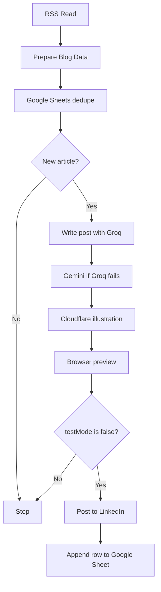

# Blog to LinkedIn

Turn a blog RSS feed into a LinkedIn post with a custom illustration. The workflow picks the newest article that has not been posted, writes the caption, draws the image, and shows you a preview before anything goes live.

`testMode` starts as `true`, so the first run stops at the preview.

## Demo

<video src="./demo.mp4" controls width="720"></video>

[Download the demo](./demo.mp4)

## How it runs

1. **RSS Read** pulls the blog feed.
2. **Google Sheets** skips articles that are already logged.
3. **Groq** writes the post. **Gemini** tries if Groq fails. A short fallback uses the article title and summary if both fail.
4. **Cloudflare Flux** draws a clean conceptual illustration from the article.
5. The preview opens in the browser. Set `testMode` to `false` in **Prepare Blog Data** only when that preview looks right. The next run can publish.

## Fill these in

Import `Wix Blog to LinkedIn v91.4 FINAL.json` into n8n. Open each node below and replace the placeholder. Save the workflow after each change.

### Blog feed

In **RSS Read**, replace `https://your-website.com/blog-feed.xml` with your real feed.

- Wix: `https://your-site.com/blog-feed.xml`
- WordPress: `https://your-site.com/feed`
- Ghost: `https://your-site.com/rss`

Open the URL in a browser first. You should see a list of article titles, not a normal web page.

### LinkedIn ids

In **Prepare Blog Data**, replace both ids.

`YOUR_PERSONAL_URN` is the id inside `urn:li:person:YOUR_PERSONAL_URN`. After you connect LinkedIn in n8n, call `GET https://api.linkedin.com/v2/userinfo` with that account. Use the `sub` value.

`YOUR_COMPANY_URN` is the number in your company page admin URL:

`https://www.linkedin.com/company/YOUR_COMPANY_URN/admin/`

`postAsOrg` is `true`, so posts go to that company page. Set it to `false` in the same node to post from the personal profile instead.

### Google Sheet

Create a spreadsheet with a tab named `Sheet1` and these column headers in row 1:

`dedupeKey`, `latestTitle`, `latestLink`, `processedAt`

Copy the id from the spreadsheet URL. It is the long text between `/d/` and `/edit`:

`https://docs.google.com/spreadsheets/d/YOUR_SHEET_ID/edit`

Paste that id over `YOUR_SHEET_ID` in both **Google Sheets Read Dedupe** and **Google Sheets Append Dedupe**.

### Cloudflare account id

In **Cloudflare Generate Image**, replace `YOUR_CLOUDFLARE_ACCOUNT_ID` in the request URL.

Open the Cloudflare dashboard. The account id is the long id in the browser address after `dash.cloudflare.com/`. The token itself is not pasted into this URL. You add the token as a credential in the next section.

### Company name

Leave `companyNameOverride` blank in **Prepare Blog Data**. The name is taken from the article link, so `acme.com` becomes Acme. Fill the override only when the domain is not the real name, for example the site is `hpe.com` and the name should be `HP`.

The caption is written from the article title and summary, not from the company name.

## Connect credentials in n8n

The file does not include API keys. After import, n8n will ask you to attach your own accounts:

- **Google Sheets** on the read and append nodes. The Google account must be allowed to edit that sheet.
- **LinkedIn** OAuth on the post and image upload nodes. The app needs permission to post and to upload images.
- **Groq** on both Groq chat models.
- **Google Gemini** on both Gemini chat models.
- **Ollama**, only if you run a local model. You can leave it unconnected if you only use Groq and Gemini.
- **Header Auth** on **Cloudflare Generate Image**. Set the header name to `Authorization` and the value to `Bearer YOUR_CLOUDFLARE_API_TOKEN`. Create the token in Cloudflare with the Workers AI permission.
